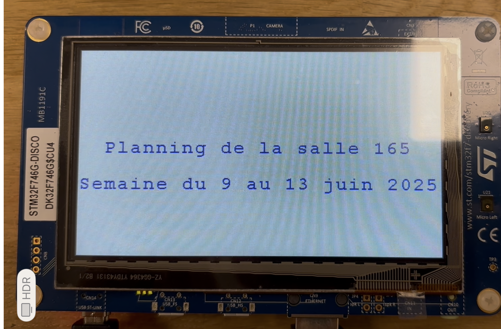

# Affichage-emploi-du-temps
Clients HTTPS embarqué sur STM32F746G-DISCO pour récupérer l'emploi du temps en temps réel 

Ce projet a été réalisé dans le cadre de mon cycle ingénieur en système embarqué à l'ENSEA.

Ce projet utilise trois librairies principales :
FreeRtos V1
LwIP
MbedTLS

Environnement de développemnt : STM32CubeIDE v 1.17.0

Le firmare permet d'envoyer une requette à un serveur HTTPS ( serveur de l'emploi du temps de notre école) ensuite
récupérer la réponse du serveur et l'afficher sur l'écran TFT de la STM32F746 DISCO.

Pour changer de serveur, il faudra changer la macro GET_REQUEST définie dans Projet/mInc/main.h, il ne faut pas oublier de changer les certificats du serveur dans Projet/Application/ssl_client_inc/ca_cert.h, et bien sûr un câble ethernet et un accès à internet si serveur distant.

